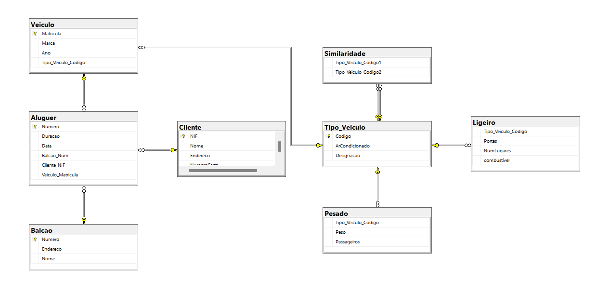
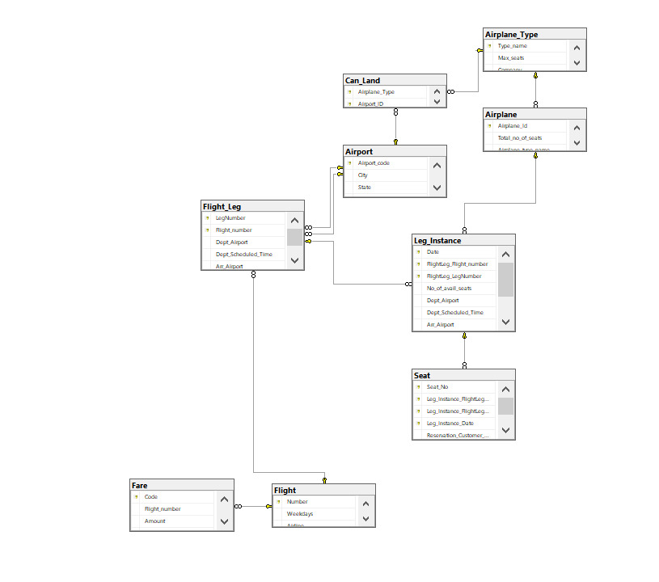

# BD: Guião 4

## ​Problema 4.1

### 1. Sistema de Gestão de um Rent-a-Car

[SQL DDL File](SQL4_1_1/SQL_4_1_1.sql "SQLFileQuestion")

### 2. Sistema de Gestão de Reservas de Voos

[SQL DDL File](SQL4_1_2/SQL_4_1_2.sql "SQLFileQuestion")

### 3. Sistema de Gestão de Stocks – Módulo de Encomendas

[SQL DDL File](SQl4_1_3/SQL_4_1_3.sql "SQLFileQuestion")

### 4. Sistema de Prescrição Eletrónica de Medicamentos 

[SQL DDL File](SQl4_1_4/SQL_4_1_4.sql "SQLFileQuestion")

### 5. Sistema de Gestão de Conferências

[SQL DDL File](SQl4_1_5/SQL_4_1_5.sql "SQLFileQuestion")

### 6. Sistema de Gestão de ATL

[SQL DDL File](SQl4_1_6/SQL_4_1_6.sql "SQLFileQuestion")

